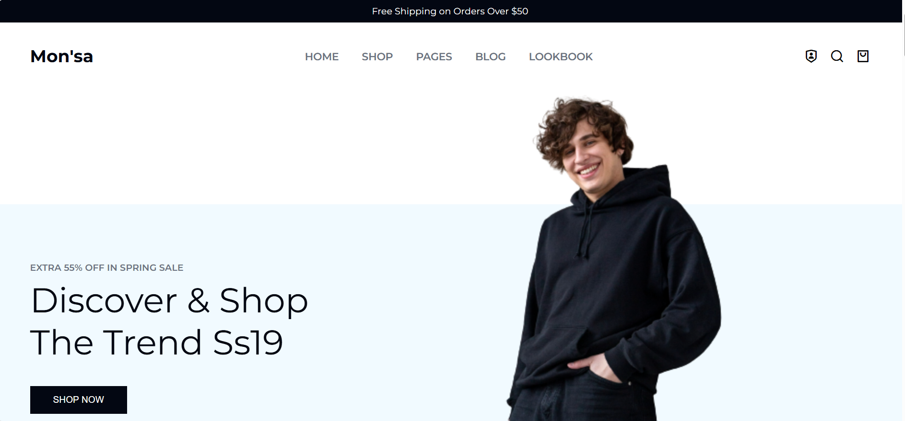

# 👗 Mon'sa – Fashion E-Commerce Landing Page

Mon'sa is a modern **fashion e-commerce landing page website** designed to showcase clothing collections, sales offers, trending fashion items, and blog content.

The website focuses on a **clean fashion UI, modern layout, and responsive design**, making it suitable for online clothing stores and fashion brands.

---

## ✨ Features

- Stylish Navigation Bar
- Spring Sale Hero Section
- New Collection Showcase
- Discount Sale Cards
- Must-Have Fashion Products Grid
- Latest Fashion News Section
- Brand Collaboration Section
- Instagram Gallery
- Professional Footer with Contact Info
- Email Subscription Form
- Responsive Design

---

## 🛠️ Technologies Used

- HTML5
- CSS3
- Remix Icons
- Responsive Web Design

---

## 📁 Project Structure

```
monsa-fashion-website/
│
├── index.html
├── styles.css
│
└── assets/
    ├── header.png
    ├── collection.jpg
    ├── sale-1.jpg
    ├── sale-2.jpg
    ├── sale-3.jpg
    ├── musthave-1.png
    ├── musthave-2.png
    ├── news-1.jpg
    ├── brand-1.png
    └── instagram images
```

---

## 🚀 How to Run the Project

1️⃣ Clone the repository

```bash
git clone https://github.com/YOUR-USERNAME/monsa-fashion-website.git
```

2️⃣ Open project folder

```bash
cd monsa-fashion-website
```

3️⃣ Run the project

Open **index.html** in your browser.

---

## 📚 Learning Highlights

- Fashion E-Commerce UI Design
- Grid Product Layout
- Landing Page Development
- Modern Website Sections
- Responsive Layout Design

---

## 📸 Preview



---

## 👩‍💻 Author

Safiya Fathima  

GitHub: https://github.com/fsafiya187  
LinkedIn: https://www.linkedin.com/in/safiya

---

## 📄 License

This project is created for educational and portfolio purposes.
